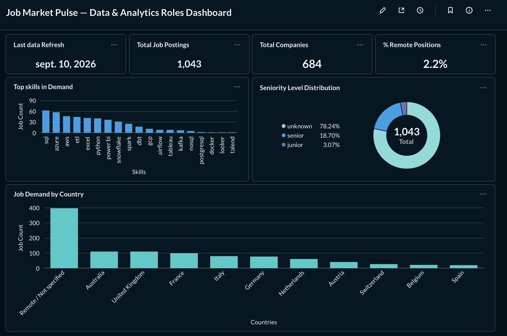

[Lire en français](README.fr.md)

# Job Market Pulse

An ETL pipeline that tracks weekly demand for data skills on the job market (Data Analyst and Data Engineer roles), from extracting two APIs all the way to a dashboard ready for analysis.

Built to demonstrate a full data engineering chain; Python extraction, Airflow orchestration, AWS cloud storage, dimensional SQL modeling, testing, visualization. Entirely free, within the limits of the AWS free tier.



## What it does

Every week, the pipeline queries two job listing sources (Remotive for fully remote roles, Adzuna for broader multi country coverage), normalizes the results into a shared schema, drops them into S3, then loads them into a PostgreSQL warehouse structured as a snowflake model. A set of aggregated views, the datamart, then feed a dashboard that answers concrete questions: which skills show up most often, how roles break down by seniority level, which countries concentrate the demand.

## Tech stack

Python for extraction and transformation; Apache Airflow for orchestration, with upstream API checks through sensors, automatic retries, and email alerts on failure; Amazon S3 for the raw zone, partitioned by date; Amazon RDS PostgreSQL as the warehouse; Metabase for visualization; pytest for unit tests on the business logic. Everything runs locally through Docker.

## Architecture

```
Remotive API ─┐
              ├─► Python extraction ─► S3 (raw, partitioned by date)
Adzuna API ───┘                             │
                                             ▼
                                   Staging PostgreSQL
                                             │
                            (skill detection, seniority,
                             geography, relevance filtering)
                                             │
                                             ▼
                              Snowflake warehouse (dwh)
                         fact_job_posting, dim_company, dim_skill,
                            dim_city, dim_country, dim_date
                                             │
                                             ▼
                               Datamart (aggregated views)
                                             │
                                             ▼
                                        Dashboard
```

The whole thing is orchestrated by a single Airflow DAG, triggered every Monday, following a clear sequence: check the APIs, extract and upload to S3, load into staging, transform into the warehouse.

## Why these choices

**Two sources rather than one.** Remotive specializes in remote work but its volume stays modest; Adzuna covers several European countries with a larger volume. Combining both, with the source traced on every listing, gives a fuller picture without depending on a single data provider.

**A snowflake model rather than a flat table.** Geography is normalized in cascade, city then country, rather than repeated on every row. That avoids naming inconsistencies and stays consistent with what's expected of a proper data warehouse in a real company.

**Capture broad, filter precisely later.** Extraction only drops titles that are clearly off topic; the real business filtering, skills detected, seniority level, happens at load time into the warehouse. That separation means the filtering logic can be adjusted without ever having to rerun an extraction.

**Views rather than materialized views for the datamart.** The data volume in this project stays modest, so a view recalculated on demand guarantees it always reflects the current state of the warehouse without any extra refresh job. At a meaningfully larger scale, the right move would be to switch to materialized views, refreshed explicitly from the DAG.

## What the dashboard shows

The dashboard groups four summary indicators (total job postings, distinct companies, share of remote roles, last data refresh date), then three detailed visuals: top skills in demand, seniority level distribution, and geographic distribution.

One thing worth being upfront about when reading the seniority chart: most listings show up as "unknown". That's not a data quality issue, it's an acknowledged limit of the method; the seniority level is inferred only from the job title, and many listings only mention it in the body of the description, not the title. Extending this detection to the full description is a reasonable next step.

## Visualization, Metabase and Power BI

The main dashboard was built with Metabase, an open source tool that runs natively on macOS through Docker, without the constraints of Power BI Desktop, which remains Windows only.

The connection to the warehouse was also tested from Power BI, pointing directly at the same RDS database; a simple refresh is enough to pull in whatever data the pipeline has produced. That test confirms the warehouse is agnostic to the visualization tool, the same database can feed several consumers without any change on its side. In this specific project, all the transformation already happens upstream in the Python and SQL pipeline, so both tools are equally suited for pure reporting. Power BI would really earn its place if additional transformation through Power Query were needed directly inside the tool, which wasn't the case here.

## Project structure

```
dags/                Airflow DAG
src/
  extract/            API clients, normalization, filtering
  transform/           staging load, transformation into the warehouse
  load/                 S3 upload
sql/
  ddl/                 staging, warehouse, and datamart schemas
  transform/            pure SQL equivalent of the Python transformation
tests/                 unit tests
docker-compose.yaml    local Airflow orchestration
```

## Running the project

Prerequisites: an AWS account (free tier), Docker Desktop, Python 3.11 or newer.

```bash
git clone https://github.com/TON_USERNAME/Job_Market_Pulse.git
cd Job_Market_Pulse
python3 -m venv .venv
source .venv/bin/activate
pip install -r requirements.txt
cp .env.example .env   # fill in with your own credentials
```

Create the S3 bucket and the RDS PostgreSQL instance, then run the SQL scripts in `sql/ddl/` in order. Then start Airflow:

```bash
docker compose up airflow-init
docker compose up -d
```

The `job_market_pulse_etl` DAG is visible on `localhost:8080`, ready to be triggered manually or left to run on its weekly schedule.

## Known limitation and next step

The pipeline currently runs locally, through Docker on a Mac. The automatic weekly trigger can only fire if the machine is on and connected at that exact moment, a real limitation for truly autonomous execution. The logical next step is deploying the exact same `docker-compose.yaml` onto an EC2 instance that stays up permanently, without changing a single line of the pipeline's business logic.
